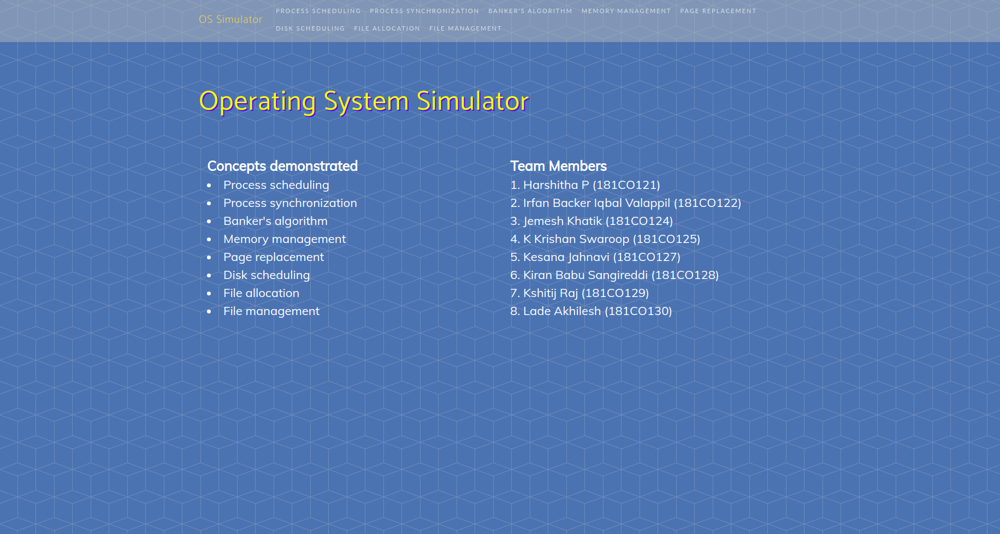
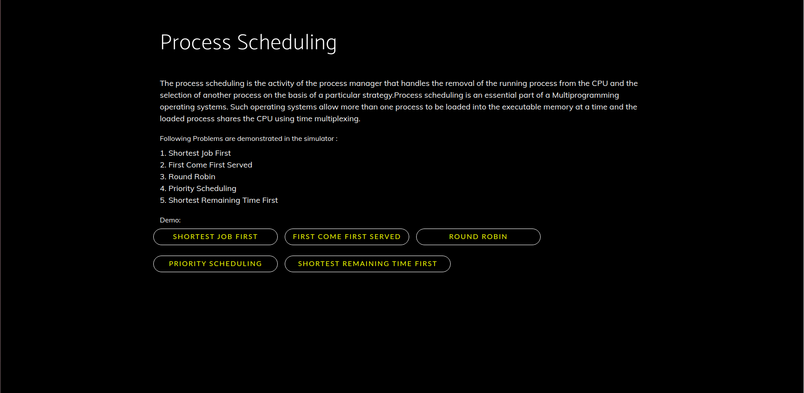
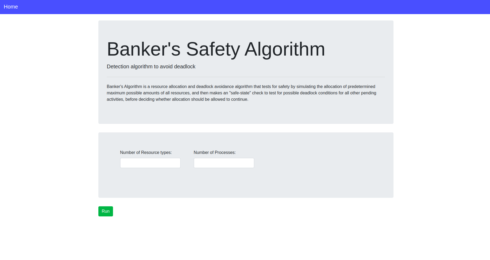

# OS-Simulator

This is an application built using Vanilla JS, HTML and CSS which simulates the Operating Systems Concepts.


### Steps to Run

```
1) Unzip the package

2) Open index.html using browser
```


### Screenshots










### Team

1. **Harshitha P (181CO121)**

2. **Irfan Backer Iqbal Valappil (181CO122)**

3. **Jemesh Khatik (181CO124)**

4. **K Krishan Swaroop (181CO125)**

5. **Kesana Jahnavi (181CO127)**

6. **Kiran Babu Sangireddi (181CO128)**

7. **Kshitij Raj (181CO129)**

8. **Lade Akhilesh (181CO130)**